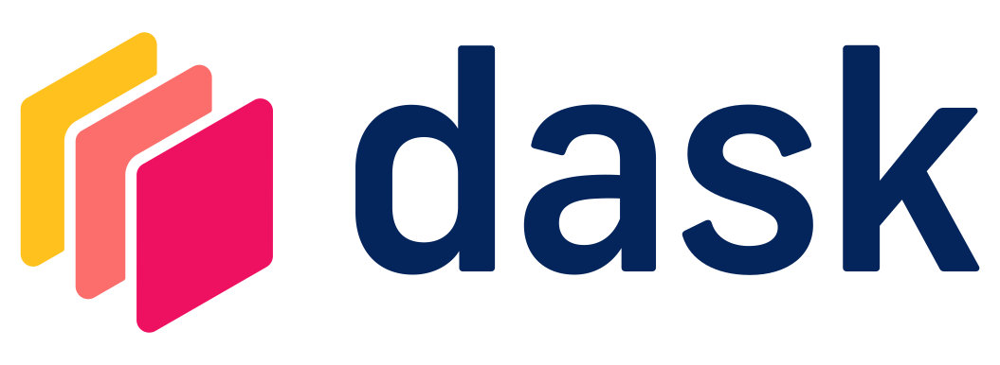

  <!-- Skill Set Box 1: Languages -->
  

    
<strong>Languages:</strong> 
     Python, C++, MATLAB, HTML, CSS, JavaScript, SQL, CUDA
     

    

      <!-- Use Devicon classes (make sure Devicon is linked in default.html) -->
      <i class="devicon-python-plain colored" title="Python"></i>
      <i class="devicon-cplusplus-plain colored" title="C++"></i>
      <i class="devicon-matlab-plain colored" title="MATLAB"></i>
      <i class="devicon-html5-plain colored" title="HTML5"></i>
      <i class="devicon-css3-plain colored" title="CSS3"></i>
      <i class="devicon-javascript-plain colored" title="JavaScript"></i>
      <i class="devicon-azuresqldatabase-plain colored" title="SQL"></i>
      
    

  

  <!-- Skill Set Box 1: Database -->
  

    
<strong>Databases/Big Data:</strong> 
      MySQL, MongoDB, GraphQL, Hadoop, Teradata
     

    

      <!-- Use Devicon classes (make sure Devicon is linked in default.html) -->
      <i class="devicon-mysql-original colored" title="MySQL"></i>
      <i class="devicon-mongodb-plain colored" title="MongoDB"></i>
      <i class="devicon-graphql-plain colored" title="GraphQL"></i>
      <i class="devicon-hadoop-plain" title="Hadoop"></i>
      
    

  

  <!-- Skill Set Box 2: Frameworks -->
   

    
<strong>Frameworks:</strong> 
      Pytorch, TensorFlow, Keras, Theano, NLTK, Fast AI, Apache Spark, ONNX, Django, Flask, React, Node.js    
     

    

      <i class="devicon-pytorch-plain colored" title="PyTorch"></i>
      <i class="devicon-tensorflow-original colored" title="TensorFlow"></i>
      <i class="devicon-keras-plain colored" title="Keras"></i>
      
      <i class="devicon-apachespark-plain colored" title="Apache Spark"></i>
      
      <i class="devicon-django-plain colored" title="Django"></i>
      <i class="devicon-flask-original colored" title="Flask"></i>
      <i class="devicon-react-original colored" title="React"></i>
      <i class="devicon-nodejs-plain-wordmark colored" title="Node.js "></i>
  

  <!-- Skill Set Box 2: Libraries/APIs -->
   

    
<strong>Libraries/APIs:</strong> 
      Scikit-learn, Pandas, NumPy, Dask, XGBoost, OpenCV, D3.js, Bokeh, OpenMP, SHAP, TensorRT, PyTensor         
     

    

      <i class="devicon-scikitlearn-plain colored" title="Scikit-learn"></i>
      <i class="devicon-pandas-plain colored" title="Pandas"></i>
      <i class="devicon-numpy-plain colored" title="NumPy"></i>
      
      <i class="devicon-opencv-plain-wordmark" title="OpenCV"></i>
      <i class="devicon-d3js-plain colored" title="D3.js"></i>
      
  

  <!-- Skill Set Box 2: Tools -->
   

    
<strong>Tools:</strong> 
      Ananconda, Jupyter, LaTeX, NVIDIA cuDNN, Power BI, GitHub Git, Jenkins, GitLab, Bitbucket, Adobe Illustrator          
     

    

      <i class="devicon-anaconda-original colored" title="Ananconda"></i>
      <i class="devicon-jupyter-plain colored" title="Jupyter"></i>
      <i class="devicon-latex-original colored" title="LaTeX "></i>
      <i class="devicon-github-original-wordmark colored" title="GitHub"></i>
      <i class="devicon-git-plain colored" title="Git"></i>
      <i class="devicon-jenkins-line" title="Jenkins"></i>
      <i class="devicon-gitlab-plain colored" title="GitLab"></i>
      <i class="devicon-bitbucket-original colored" title="Bitbucket"></i>
      <i class="devicon-illustrator-plain colored" title="Adobe Illustrator"></i>
    

  

  <!-- Skill Set Box 2: Technologies -->
   

    
<strong>Technologies/ Cloud:</strong> 
      AWS, GCP, Azure, Docker, Kubernetes, Linux, ETL Tools (Informatica), Tableau, Hugging Face                
     

    

      <i class="devicon-amazonwebservices-plain-wordmark colored" title="AWS"></i>
      <i class="devicon-googlecloud-plain-wordmark" title="Google Cloud "></i>
      <i class="devicon-azure-plain" title="Azure"></i>
      <i class="devicon-docker-plain colored" title="Docker"></i>
      <i class="devicon-kubernetes-plain-wordmark" title="Kubernetes"></i>
      <i class="devicon-linux-plain colored" title="Linux"></i>
      <i class="devicon-bitbucket-original colored" title="Bitbucket"></i>
      
    

  

